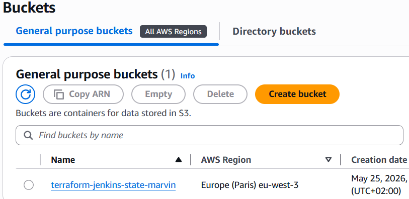
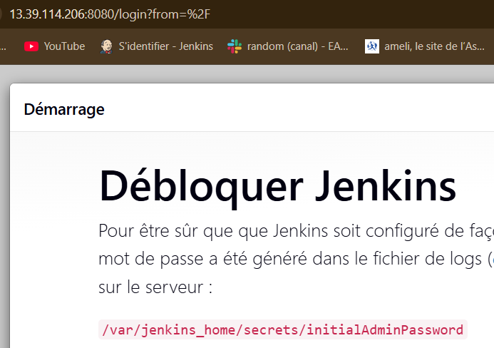
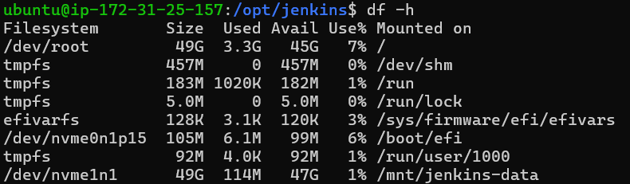
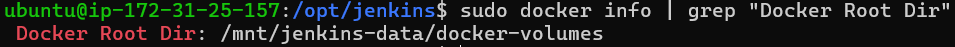

# Déploiement automatisé d'un serveur Jenkins sur AWS avec Terraform

## Description
Ce projet Terraform permet de déployer automatiquement un serveur Jenkins
conteneurisé (Docker) sur une instance EC2 AWS Ubuntu 22.04 (Jammy).
L'infrastructure est découpée en 5 modules réutilisables et indépendants.
Le volume EBS est monté dans l'OS et utilisé comme stockage Docker.
Le tfstate est stocké sur un backend S3 distant.

## Architecture

```
terraform-jenkins/
├── modules/
│   ├── key_pair/       # Génère une paire de clés SSH dynamiquement
│   ├── ebs/            # Crée un volume de stockage attaché à l'EC2
│   ├── eip/            # Réserve une IP publique fixe
│   ├── security_group/ # Ouvre les ports 80, 443, 8080 et 22 (dynamic blocks)
│   └── ec2/            # Crée l'instance Ubuntu Jammy
└── app/
    ├── main.tf          # Orchestre les 5 modules + attachements (couplage faible)
    ├── variables.tf     # Variables configurables (taille, nom, région, règles SG...)
    ├── outputs.tf       # Affiche l'IP et le DNS à la fin du déploiement
    ├── user_data.sh     # Script d'installation Docker + Jenkins au démarrage
    └── jenkins_ec2.txt  # Fichier généré automatiquement avec l'IP et le DNS
```

## Prérequis
- Terraform >= 1.0
- AWS CLI installé et configuré (`aws configure`)
- Un compte AWS avec un utilisateur "IAM" disposant des droits "EC2" et "S3"
- Les clés d'accès AWS (Access Key ID + Secret Access Key)
- Un bucket S3 créé pour stocker le tfstate

## Providers utilisés
| Provider | Version | Utilité |
|----------|---------|---------|
| `hashicorp/aws` | ~> 5.0 | Crée les ressources AWS (EC2, EBS, EIP, SG, Key Pair) |
| `hashicorp/tls` | ~> 4.0 | Génère la paire de clés RSA dynamiquement |
| `hashicorp/local` | ~> 2.0 | Écrit les fichiers locaux (.pem, jenkins_ec2.txt) |

## Modules

### module `key_pair`
Génère une paire de clés RSA 4096 bits via le provider `tls`. La clé publique
est envoyée à AWS, la clé privée est sauvegardée en `.pem` en local (`0400`).

### module `security_group`
Crée un pare-feu AWS avec des **dynamic blocks** — les règles sont déclarées
comme variables dans `app/` ce qui rend le module entièrement réutilisable.

| Port | Utilité |
|------|---------|
| 22 | SSH |
| 80 | HTTP |
| 443 | HTTPS |
| 8080 | Jenkins |

### module `ebs`
Crée un volume EBS de 50Go (disque virtuel) dont la taille est variabilisée.
L'attachement à l'EC2 se fait dans `app/main.tf` pour un couplage faible.

### module `eip`
Réserve une Elastic IP (adresse IP publique fixe). L'association à l'EC2
se fait dans `app/main.tf` pour un couplage faible.

### module `ec2`
Récupère automatiquement la dernière AMI Ubuntu 22.04 (Jammy) via un
`data source`. Crée l'instance EC2 `t3.micro` avec un `root_block_device`
de 50Go en `gp3`.

## Bonnes pratiques appliquées
- **Couplage faible** : `aws_volume_attachment` et `aws_eip_association` sont
  dans `app/main.tf` et non dans les modules, pour que chaque module reste
  indépendant et réutilisable
- **Dynamic blocks** : les règles du Security Group sont variabilisées et
  déclarées dans `app/variables.tf`
- **Remote backend S3** : le `terraform.tfstate` est stocké sur S3 et non
  en local
- **Provisioner remote-exec** : monte le volume EBS dans l'OS et configure
  Docker pour utiliser ce disque comme stockage
- **Clés et tfstate** exclus du dépôt Git via `.gitignore`

## Déploiement

### 1. Cloner le dépôt
```bash
git clone https://github.com/Marvin-Git-Project/terraform-jenkins.git
cd terraform-jenkins
```

### 2. Configurer AWS CLI
```bash
aws configure
# Entrer : Access Key ID, Secret Access Key, région (eu-west-3), format (json)
```

### 3. Créer le bucket S3 pour le backend
Sur la console AWS → S3 → Create bucket :
- Nom : `terraform-jenkins-state-marvin`
- Région : `eu-west-3`

### 4. Initialiser Terraform
```bash
cd app
terraform init
```

### 5. Vérifier le plan de déploiement
```bash
terraform plan
```
Simule le déploiement sans rien créer. Vérifie que les 10 ressources
seront créées sans erreur.

### 6. Déployer l'infrastructure
```bash
terraform apply
```
Terraform crée les 10 ressources et affiche à la fin :
```
Apply complete! Resources: 10 added, 0 changed, 0 destroyed.

Outputs:
public_ip  = "XX.XX.XX.XX"
public_dns = "ec2-XX-XX-XX-XX.eu-west-3.compute.amazonaws.com"
```

### 7. Accéder à Jenkins
Attendre environ 5 minutes que le script `user_data.sh` termine
l'installation, puis ouvrir dans le navigateur :
```
http://<public_ip>:8080
```

Récupérer le mot de passe administrateur initial :
```bash
ssh -i jenkins-key.pem ubuntu@<public_ip>
sudo docker exec jenkins cat /var/jenkins_home/secrets/initialAdminPassword
```

### 8. Fichier de sortie généré automatiquement
```bash
cat jenkins_ec2.txt
# IP publique : XX.XX.XX.XX
# Nom de domaine : ec2-XX-XX-XX-XX.eu-west-3.compute.amazonaws.com
```

### 9. Détruire l'infrastructure
```bash
terraform destroy
```
(À exécuter après chaque session de test pour éviter des frais AWS)

## Captures d'écran

### Terraform apply — 10 ressources déployées


### Terraform output — IP et DNS générés


### Console AWS — Instance EC2 en cours d'exécution


### Console AWS — Volume EBS 50Go attaché


### Console AWS — Elastic IP réservée


### Console AWS — Security Group avec règles entrantes


### Console AWS — Key Pair générée dynamiquement


### Console AWS — Backend S3 avec le tfstate


### Jenkins — Page de déverrouillage


### Fichier jenkins_ec2.txt généré automatiquement


### SSH — Volume EBS monté dans l'OS


### SSH — Docker configuré sur le volume EBS


## Fichiers sensibles
Ces fichiers sont exclus du dépôt Git via `.gitignore` :
- `*.pem` → clé privée SSH (ne doit jamais être partagée)
- `*.tfstate` → état Terraform contenant des données sensibles
- `*.tfstate.backup` → sauvegarde de l'état Terraform
- `.terraform/` → providers téléchargés localement
- `crash.log` → logs de crash Terraform

## Auteur
Projet réalisé par Marvin-Git-Project dans le cadre d'un bootcamp proposé
par Eazytraining.
