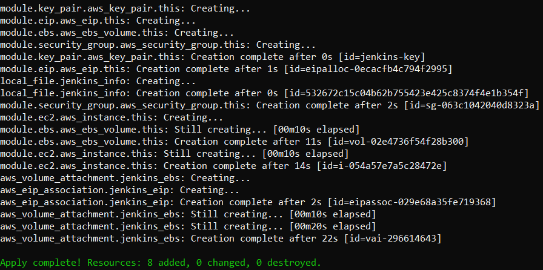
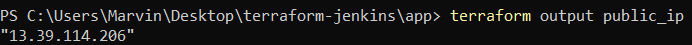
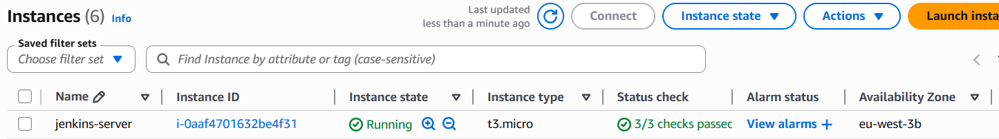
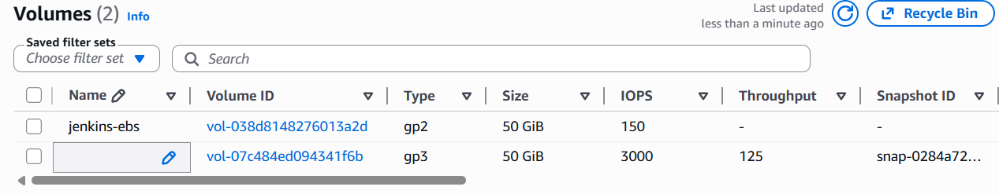
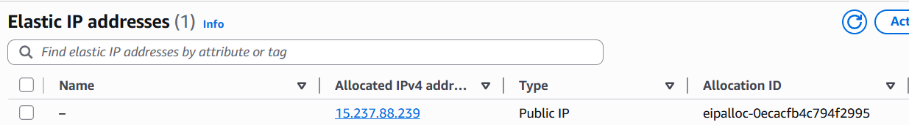
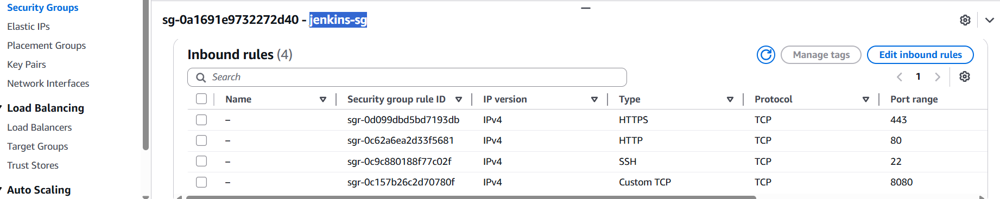
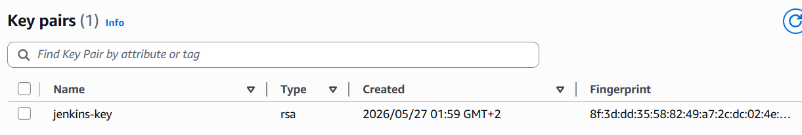
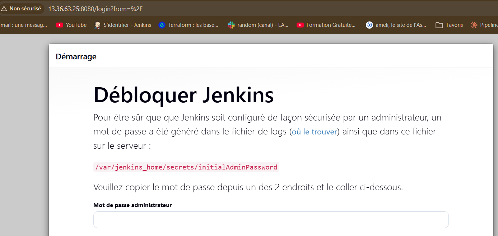
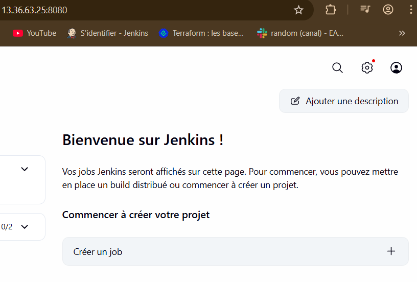
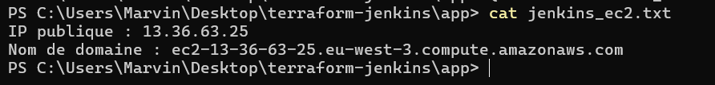

# Déploiement automatisé d'un serveur Jenkins sur AWS avec Terraform

## Description
Ce projet Terraform permet de déployer automatiquement un serveur Jenkins
conteneurisé (Docker) sur une instance EC2 AWS Ubuntu 22.04 (Jammy).
L'infrastructure est découpée en 5 modules réutilisables et le déploiement
est entièrement automatisé.

## Architecture

```
terraform-jenkins/
├── modules/
│   ├── key_pair/       # Génère une paire de clés SSH dynamiquement
│   ├── ebs/            # Crée un volume de stockage attaché à l'EC2
│   ├── eip/            # Réserve une IP publique fixe
│   ├── security_group/ # Ouvre les ports 80, 443, 8080 et 22
│   └── ec2/            # Crée l'instance Ubuntu et relie tous les modules
└── app/
    ├── main.tf          # Orchestre les 5 modules
    ├── variables.tf     # Variables configurables (taille, nom, région...)
    ├── outputs.tf       # Affiche l'IP et le DNS à la fin du déploiement
    ├── user_data.sh     # Script d'installation Docker + Jenkins au démarrage
    └── jenkins_ec2.txt  # Fichier généré automatiquement avec l'IP et le DNS
```

## Prérequis
- Terraform >= 1.0
- AWS CLI configuré (`aws configure`)
- Un compte AWS avec un utilisateur IAM disposant des droits EC2
- Les clés d'accès AWS (Access Key ID + Secret Access Key)

## Providers utilisés
| Provider | Version | Utilité |
|----------|---------|---------|
| `hashicorp/aws` | ~> 5.0 | Crée les ressources AWS (EC2, EBS, EIP, SG, Key Pair) |
| `hashicorp/tls` | ~> 4.0 | Génère la paire de clés RSA dynamiquement |
| `hashicorp/local` | ~> 2.0 | Écrit les fichiers locaux (.pem, jenkins_ec2.txt) |

## Modules

### module `key_pair`
Génère une paire de clés RSA 4096 bits via le provider `tls`. La clé publique
est envoyée à AWS, la clé privée est sauvegardée en `.pem` en local (`0400`).

### module `security_group`
Crée un pare-feu AWS autorisant le trafic entrant sur 4 ports :

| Port | Utilité |
|------|---------|
| 22 | SSH |
| 80 | HTTP |
| 443 | HTTPS |
| 8080 | Jenkins |

### module `ebs`
Crée un volume de stockage EBS (disque virtuel) dont la taille est variabilisée.
Attaché à l'EC2 sur le device `/dev/sdf`.

### module `eip`
Réserve une IP publique fixe et l'associe à l'EC2. Sans EIP, l'IP changerait
à chaque redémarrage de l'instance.

### module `ec2`
Module central. Récupère automatiquement la dernière AMI Ubuntu 22.04 (Jammy)
via un `data source`, crée l'instance, attache le security group, la clé SSH
et le volume EBS, puis exécute `user_data.sh` au démarrage.

## Installation de Jenkins via Docker Compose
Le fichier `user_data.sh` est exécuté automatiquement au premier démarrage
de l'instance EC2. Il effectue les opérations suivantes :
1. Mise à jour du système Ubuntu
2. Installation de Docker
3. Téléchargement de Docker Compose
4. Création du fichier `docker-compose.yml` dans `/opt/jenkins/`
5. Lancement du conteneur Jenkins en mode détaché (`docker-compose up -d`)

Jenkins est accessible sur le port **8080** une fois le conteneur démarré.

## Déploiement

### 1. Cloner le dépôt
```bash
git clone https://github.com/Marvin-Git-Project/terraform-jenkins.git
cd terraform-jenkins
```

### 2. Configurer AWS CLI
```bash
aws configure
# Entrer : Access Key ID, Secret Access Key, région (eu-west-3), format (json)
```

### 3. Initialiser Terraform
```bash
cd app
terraform init
```
Cette commande télécharge les providers AWS, TLS et Local déclarés dans
le `main.tf`.

### 4. Vérifier le plan de déploiement
```bash
terraform plan
```
Simule le déploiement sans rien créer sur AWS. Permet de vérifier que
les 9 ressources seront bien créées sans erreur.

### 5. Déployer l'infrastructure
```bash
terraform apply
```
Terraform crée les 9 ressources dans l'ordre et affiche à la fin :
```
Apply complete! Resources: 9 added, 0 changed, 0 destroyed.

Outputs:
public_ip  = "XX.XX.XX.XX"
public_dns = "ec2-XX-XX-XX-XX.eu-west-3.compute.amazonaws.com"
```

### 6. Accéder à Jenkins
Attendre environ 5 minutes que le script `user_data.sh` termine
l'installation, puis ouvrir dans le navigateur :
```
http://<public_ip>:8080
```

Récupérer le mot de passe administrateur initial :
```bash
ssh -i jenkins-key.pem ubuntu@
sudo docker exec jenkins cat /var/jenkins_home/secrets/initialAdminPassword
```

### 7. Fichier de sortie généré automatiquement
```bash
cat jenkins_ec2.txt
# IP publique : XX.XX.XX.XX
# Nom de domaine : ec2-XX-XX-XX-XX.eu-west-3.compute.amazonaws.com
```

### 8. Détruire l'infrastructure
```bash
terraform destroy
```
À exécuter après chaque session de test pour éviter des frais AWS
inutiles.

## Captures d'écran

### Terraform apply — déploiement réussi


### Terraform outputs — IP et DNS générés


### Console AWS — Instance EC2 en cours d'exécution


### Console AWS — Volume EBS attaché


### Console AWS — Elastic IP réservée


### Console AWS — Security Group et ses règles entrantes


### Console AWS — Key Pair générée


### Jenkins — Page de déverrouillage


### Jenkins — Dashboard opérationnel


### Fichier jenkins_ec2.txt généré


## Fichiers sensibles
Ces fichiers sont exclus du dépôt Git via `.gitignore` :
- `*.pem` → clé privée SSH (ne doit jamais être partagée)
- `*.tfstate` → état Terraform contenant des données sensibles
- `*.tfstate.backup` → sauvegarde de l'état Terraform
- `.terraform/` → providers téléchargés localement
- `crash.log` → logs de crash Terraform

## Auteur
Projet réalisé par Marvin-Git-Project dans le cadre d'un bootcamp proposé
par Eazytraining.
